# 
 :fallen_leaf: Bootcamp-SenderoVerde :fallen_leaf: 

<!--- ¿Qué hace el proyecto? ¿De que se trata? ¿Qué componentes tiene? --->
# Abstract
En la última década una gran parte del bosque en el mundo sufrió una reducción de área considerable, debido al crecimiento de cultivos de alimentos, deforestación y al asentamiento de comunidades humanas. Estos hechos generaron que varios organismos internacionales tomen esta problemática como prioritaria, ya que las consecuencias generadas producían grandes catástrofes ambientales. El impacto que podría tener el proyecto se daría en un punto común que comparten ambos ODS 13 (Acción por el clima) y 15 (Vida de ecosistemas terrestres). Ya que la información que brindaría la plataforma, permitiría la protección y el monitoreo de la cobertura vegetal en áreas en riesgo de deforestación en territorio boliviano. Como si de un eslabón se tratase, la protección de esta cobertura vegetal permite la preservación de ecosistemas y biodiversidad del área de estudio. Esta preservación también permite evitar el deterioro de mecanismos naturales para la captura de dióxido de carbono. En el contexto boliviano esta problemática es recurrente, debido a que varias extensiones de bosque reducen su área de manera continua por chaqueos, desmontes, extensión de la frontera agrícola y actividades de deforestación ilegal. Para el desarrollo del proyecto se plantea usar imágenes satelitales de distintas fechas dentro las regiones verdes de gran importancia de la ciudad de La Paz o otros sectores dentro de Bolivia. El proyecto llega a tener varias métricas de evaluación, para los resultados en el proceso de entrenamiento se utilizará la evaluación de la precisión, perdida, especificidad y IoU, para la evaluación general del sistema de segmentación se utilizo la métrica de evaluación de mean Intersection Over Union (meanIoU).
# :rocket: Funcionalidades mas importantes :rocket:
El siguiente proyecto consiste en la implementación de un sistema de segmentación en imágenes satelitales, este cuenta con dos funcionalidades importantes.
- El sistema es capas de reconocer el porcentaje de deforestación dentro una zona seleccionada.
- Y también puede realizar un análisis temporal para poder predecir la deforestación futuro.
# 
 :evergreen_tree: Descripción del proyecto :evergreen_tree: 

# :ear_of_rice: Dataset :ear_of_rice:
El dataset utilizado puede ser obtenido por este [enlace](https://drive.google.com/file/d/1TzqauLBhEk29VqhWDfKY-fv-BlyVHxG7/view?usp=sharing), detallando este cuenta con un total de 322 datos, cada dato contiene una imagen satelital RGB y otra imagen que contiene la imagen segmentada. Respecto a las clases en total se tiene 3, el primero denotado por el color rojo [185,0,0] representa el área deforestada, el segundo denotado por el color verde [0,83,0] representa las áreas verdes y por último el color azul [0,0,45] representa objetos variados o sin etiqueta (lagos, casas, etc.).

  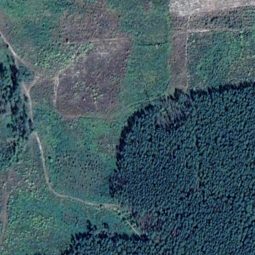
  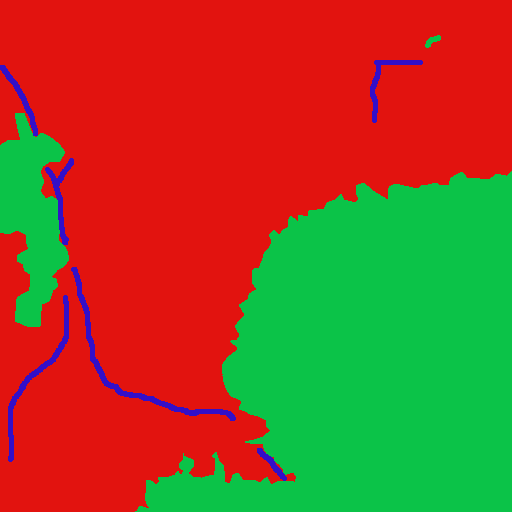

Un problema que se corrigio fue la minima cantidad de datos que se tiene, al ser muy limitada se realizó data augmentation con dos técnicas la primera es Flipping y la segunda Bright Variation.

  

# :potted_plant: Modelo :potted_plant:
El modelo utilizado es el ResUnet, más información sobre este es encuentra en este [enlace](https://arxiv.org/pdf/1711.10684.pdf). Resumiendo, este modelo es mayormente utilizado por su alto rendimiento con una cantidad baja o moderada de parámetros, su arquitectura está dividida en 3 partes. La primera es denominada encoder, este tiene como entrada una imagen RGB la cual pasa por diferentes bloques de codificación(encoders), este ayuda a la red a aprender las representaciones abstractas. Después viene el bridge que consiste en una pre activación de los bloques residuales y por último el decoder o decodificador, este toma al bridge y las skip connections de los diferentes bloques codificados y aprende la representación semántica, en la siguiente figura se puede apreciar gráficamente los bloques y la arquitectura en general.

  
  

# :leaves: Training :leaves:
Se entrenaron varios modelos ([Notebooks](https://github.com/reynaldocruz/Bootcamp-SenderoVerde/tree/main/Notebooks)), de los cuales dos destacaron en sus resultados, el primero es un entrenamiento de 2 clases (Binario) y el otro de 3 clases (Multiclase), comenzando por el primero se utilizaron los siguientes hiperparámetros:
* Learning Rate = 1e-3
* Batch size = 16
* Verbose = 1
* Epocas = 50
* Optimizador = Adam
* Funcion de perdida = Binary Crossentropy

Las gráficas del entrenamiento pueden verse a continuación.

 Modelo Binario 

  
  
  

Para el segundo se utilizaron los siguientes hiperparámetros:
* Learning Rate = 1e-4
* Batch size = 16
* Verbose = 1
* Epocas = 50
* Optimizador = Adam
* Funcion de perdida = Categorical Crossentropy

Las gráficas del entrenamiento pueden verse a continuación.

 Modelo Multiclase 

  
  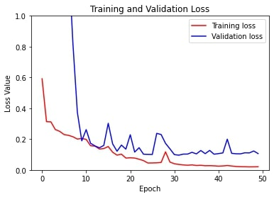
  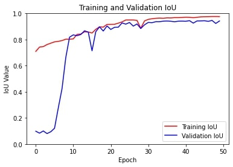

# :herb: Evaluación :herb:
Como anteriormente es mencionado, se analizó el modelo con la métrica de evaluación de *meanIoU* obteniéndose un 85.23% de precisión con el modelo binario (número de clases iguales a 2) y 88.09% con el multiclase (número de clases iguales a 3).

  :herb: Modelo Binario :herb:
  
  
  

  :herb: Modelo Multiclase :herb:
  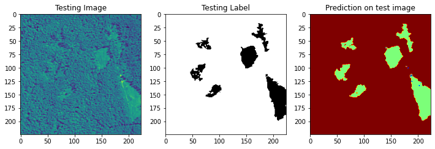
  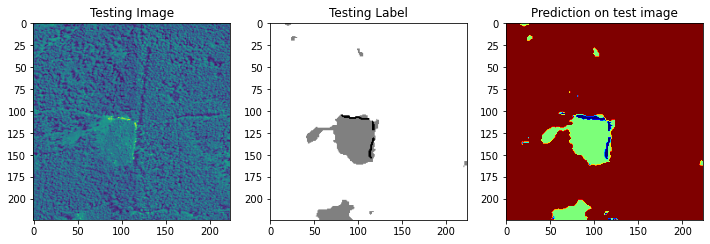
  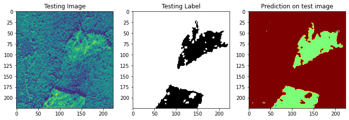

# :maple_leaf: Implementacion :maple_leaf:
Se realizó un interface para que el usuario pueda utilizar el modelo con distintos sectores de los cuales se recopiló datos, primero se selecciona el lugar, después con los variadores se selecciona el área donde se quiere hacer el análisis.

  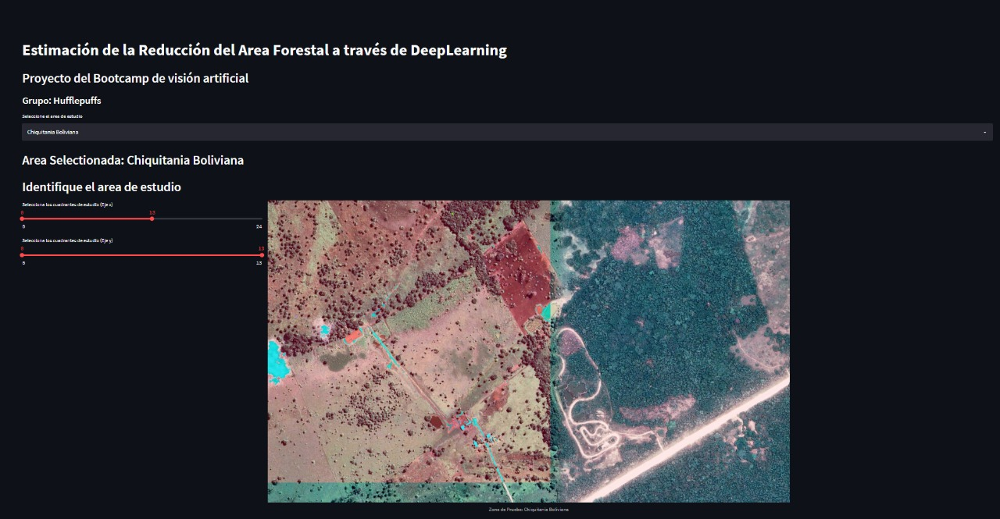
  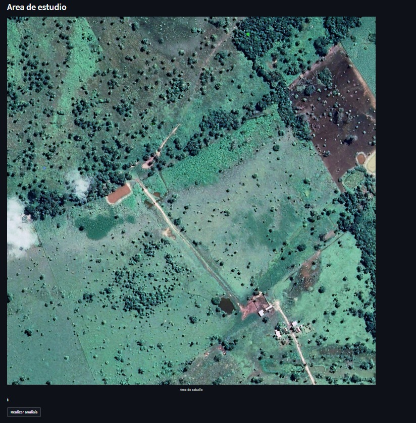

Una vez seleccionada este hace un análisis de la imagen actual y temporales, generando la segmentación semántica de las áreas verdes y deforestadas. Además de entregar los valores porcentuales, también entrega una proyección lineal del futuro porcentaje de deforestación.

  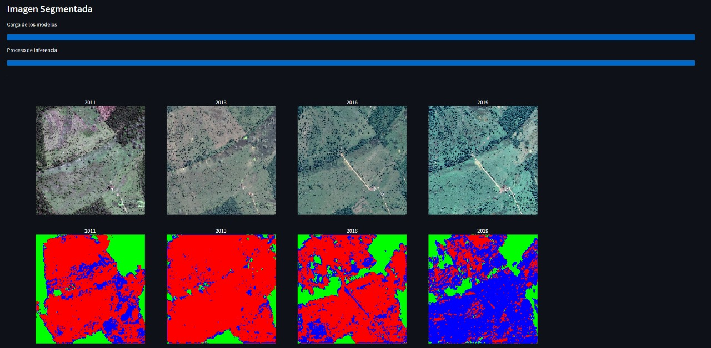
  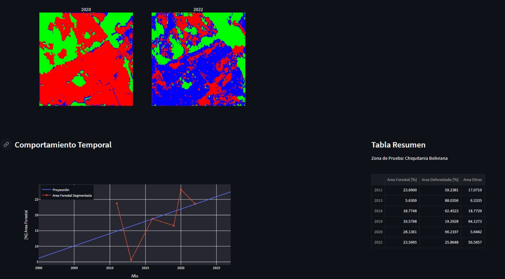

# :cactus:Tecnologías/Frameworks utilizados :cactus:
* TensorFlow
* OpenCV
* Python 3
* Google Colab
* Streamlit (GUI)

# :potted_plant: Instalación :potted_plant:
Para el entrenamiento, evaluación y la obtención del modelo en formato TFLite o HDF5 simplemente se puede ejecutar cualquiera de los dos ([Notebooks](https://github.com/reynaldocruz/Bootcamp-SenderoVerde/tree/main/Notebooks)) o puedes descargarlos conjuntamente con el dataset y después cambiar las direcciones de los archivos en el notebook manualmente y ejecutarlo localmente.
Para el prototipo funcional se requiere instalar los requirements y hacer correr el programa principal.
* pip install requirements.txt

# :four_leaf_clover: Creditos :four_leaf_clover:
:fallen_leaf: Reynaldo Esteban Cruz Villagomez :fallen_leaf: reynaldocruz102@gmail.com

:leaves: Mario Martin Torrez Callisaya :leaves: mariomartintc@hotmail.com

:cactus: Jorge Armando Quiroz Pérez :cactus: jorge.armando.quiroz.perez@gmail.com

:potted_plant: Grisel Quispe :potted_plant: griseleliana79@gmail.com
