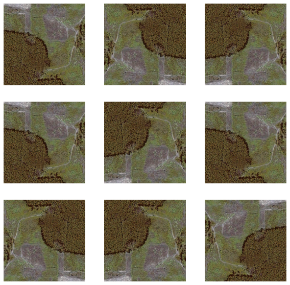
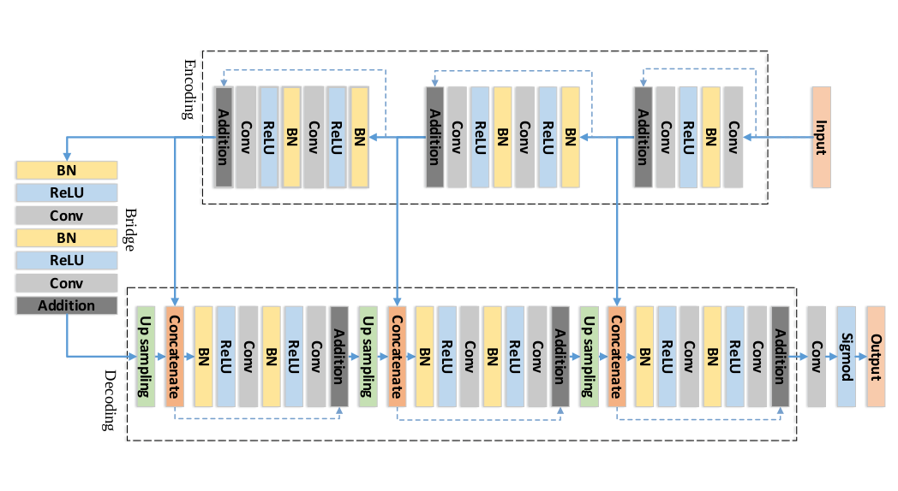
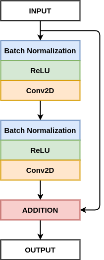
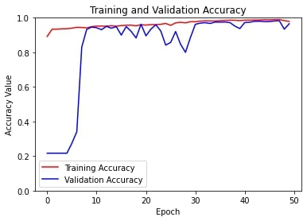
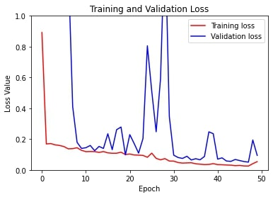
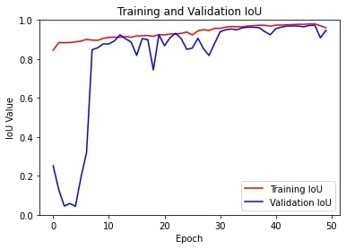
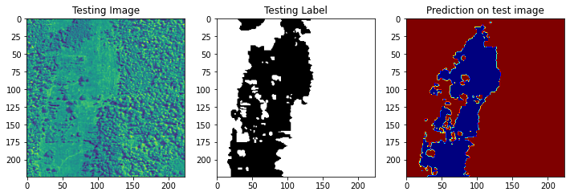
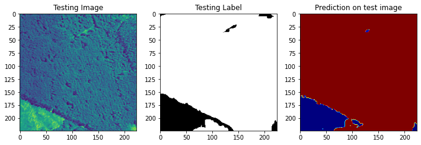
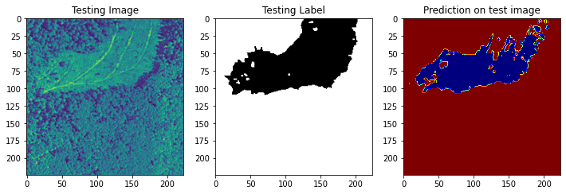

# 
 :fallen_leaf: Bootcamp-SenderoVerde :fallen_leaf: 

<!--- ¿Qué hace el proyecto? ¿De que se trata? ¿Qué componentes tiene? --->
# Abstract
En la última década una gran parte del bosque en el mundo sufrió una reducción de área considerable, debido al crecimiento de cultivos de alimentos, deforestación y al asentamiento de comunidades humanas. Estos hechos generaron que varios organismos internacionales tomen esta problemática como prioritaria, ya que las consecuencias generadas producían grandes catástrofes ambientales. El impacto que podría tener el proyecto se daría en un punto común que comparten ambos ODS 13 (Acción por el clima) y 15 (Vida de ecosistemas terrestres). Ya que la información que brindaría la plataforma, permitiría la protección y el monitoreo de la cobertura vegetal en áreas en riesgo de deforestación en territorio boliviano. Como si de un eslabón se tratase, la protección de esta cobertura vegetal permite la preservación de ecosistemas y biodiversidad del área de estudio. Esta preservación también permite evitar el deterioro de mecanismos naturales para la captura de dióxido de carbono. En el contexto boliviano esta problemática es recurrente, debido a que varias extensiones de bosque reducen su área de manera continua por chaqueos, desmontes, extensión de la frontera agrícola y actividades de deforestación ilegal. Para el desarrollo del proyecto se plantea usar imágenes satelitales de distintas fechas dentro las regiones verdes de gran importancia de la ciudad de La Paz y otros sectores dentro de Bolivia. El proyecto llega a tener varias métricas de evaluación, para los resultados en el proceso de entrenamiento se utilizará la evaluación de la exactitud, precisión, sensibilidad, especificidad y F1 score, para la evaluación general del sistema de segmentación se utilizará la métrica de evaluación de Intersection Over Union (IoU).
# :rocket: Motivación :rocket:
# :star: Funcionalidades mas importantes :star:
El siguiente proyecto consiste en la implementacion de un sistema de segmentacion en imagenes satelitales, este cuenta con dos funcionalidades importantes.
- El sistema es capas de reconocer el porcentaje de deforestamiento dentro una zona seleccionada.
- Y tambien puede realizar un analisis temporal para poder predecir el deforestamiento temporal futuro.
# 
 :evergreen_tree: Descripción del proyecto :evergreen_tree: 

# :ear_of_rice: Dataset :ear_of_rice:
El dataset utilizado puede ser obtenido por este [enlace](https://arxiv.org/pdf/1711.10684.pdf), detallando este cuenta con un total de 322 datos, cada dato contiene una imagen satelital RGB y otra imagen que contiene la imagen segmentada. Respecto a las clases en total se tiene 3, el primero denotado por el color rojo [185,0,0] representa el area deforestada, el segundo denotado por el color verde [0,83,0] representa las areas verder y por ultimo el color azul [0,0,45] representa objetos variados o sin atiqueta (lagos, casas, etc.).

  
  

Un problema que se noto al utilizar estos datos es la variabilidad entre el espacio de color por lo cual se realizo un preprocesado de datos, este consiste en ...
Otra problema fue la cantidad de datos que se tiene al ser muy limitada se realiso data aumentation con dos tecnicas la primera es Flipping y la segunda Bright Variation.

  

# :potted_plant: Modelo :potted_plant:
El modelo utilizado es el ResUnet, mas informacion sobre este es encuentra en este [enlace](https://arxiv.org/pdf/1711.10684.pdf). Resumiendo, este modelo es mayormente utilizado por su alto rendimiento con una cantidad baja o moderada de parametros, su arquitectura esta dividida en 3 partes. La primera es denominada encoder, este tiene como entrada la imagen la cual pasa por diferentes bloques de codificacion(encoders), lo cual ayuda a la red a aprender las representaciones abstractas. Despues viene el bridge que consiste en una preactivacion de los bloques residuales y por ultimo el decoder o decodificador toma al bridge y las skip connections de los diferentes bloques codificados y aprende la representacion semantica, en la siguiente figura se puede apreciar graficamente los bloques y la arquitectura en general.

  
  

# :leaves: Training :leaves:
Para el entrenamiento se entrenaron varios modelos, donde los que mejor generalizaban tienen los siguientes hiperparametros ....., las graficas pueden verse a continuacion. Se experimento con 3 funciones de perdida que generalmente se utilizan para este tipo de tareas. 
Iou Loss:
Binary Crossentropy:
Categorical Crossentropu:
Diff loss:

  
  
  

# :herb: Evaluación :herb:
Como anteriormente se mensionaba se analizo el modelo con la metrica de evaluacion de meanIoU obteniendose un 85.23% de presicion con el modelo binario (numero de clases igual a 2) y 88.09% con el multiclase(numero de clases igual a 3).

  # :herb: Modelo Binario :herb:
  
  
  

  # :herb: Modelo Multiclase :herb:
  
  
  

# :maple_leaf: Implementacion :maple_leaf:
Se realizo una interface para que el usuario pueda 
# :cactus:Tecnologías/Frameworks utilizados :cactus:
# :potted_plant: Instalación :potted_plant:
# :four_leaf_clover: Creditos :four_leaf_clover:
